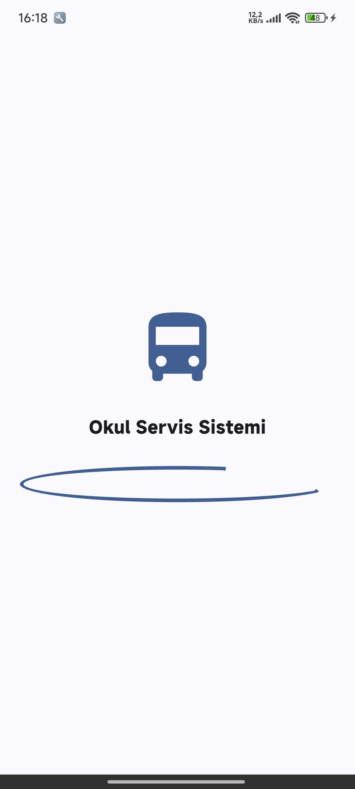
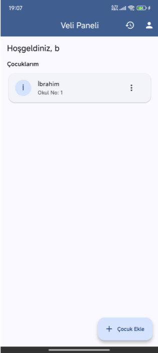
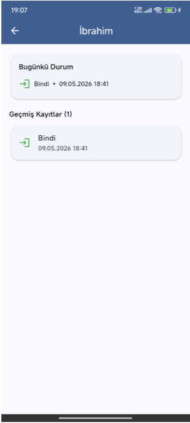
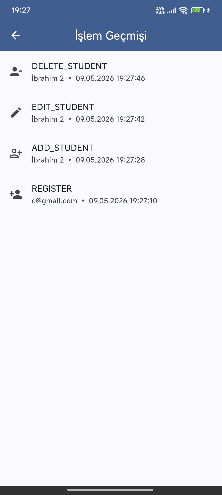

# 🚌 Okul Servis Yoklama ve Sefer Sistemi

Selçuk Üniversitesi Teknoloji Fakültesi **Bilgisayar Mühendisliği**
**Mobil Programlama** dersi final projesi olarak Flutter + Supabase ile
geliştirilmiş, okul servisinin günlük seferlerini yöneten, şoförün öğrenci
yoklaması aldığı, velinin ise çocuğunun servise binip‑inme durumunu takip
ettiği bir mobil uygulamadır.

---

## 👤 Öğrenci Bilgileri

- **Ad Soyad:** [İbrahim Ertürk]
- **Numara:** [243301033]
- **Bölüm:** Bilgisayar Mühendisliği
- **Ders:** Mobil Programlama

---

## ✨ Özellikler

- E‑posta / şifre ile **kayıt ol – giriş yap – çıkış yap**
- **Oturum kalıcılığı** (uygulama kapatılıp açıldığında oturum devam eder)
- **2 farklı kullanıcı rolü:** Şoför & Veli
- Şoför: Sefer başlatma / bitirme, **yoklama alma** (Bindi / İndi / Gelmedi)
- Veli: **Çocuk ekleme / düzenleme / silme**, çocuğun günlük durumunu canlı takip
- Yapılan **her işlem için log kaydı** (giriş/çıkış, sefer, yoklama, CRUD)
- Yoklama anında veliye **lokal bildirim**
- Material 3 temiz ve modern arayüz, tam Türkçe

---

## 🧩 Kullanılan Paketler

`pubspec.yaml` dosyasından:

| Paket | Görev |
|---|---|
| `supabase_flutter` | Auth + Database + Realtime |
| `provider` | State management |
| `go_router` | Router (named, nested, params) |
| `intl` | Tarih/saat formatlama (TR locale) |
| `shared_preferences` | Yardımcı kalıcı saklama |
| `flutter_local_notifications` | Yoklama bildirimleri |
| `flutter_dotenv` | Supabase URL/anahtarları için `.env` yönetimi |

> **Not:** Şartname gereği yerel SQLite **kullanılmamıştır**. Tüm veriler
> Supabase (PostgreSQL) üzerinde tutulmaktadır.

---

## 🧪 Test Hesapları

Aşağıdaki hesaplar Supabase üzerinde önceden oluşturulmuştur (siz de
`/register` ekranından kendi rolünüzü seçerek yeni hesap açabilirsiniz):

| Rol | E‑posta | Şifre |
|---|---|---|
| 🚍 **Şoför** | `a@gmail.com` | `123123` |
| 👨‍👩‍👧 **Veli** | `b@gmail.com` | `123123` |

---

## 📷 Ekran Görüntüleri

| Açılış | Veli Paneli |
|---|---|
|  |  |

| Çocuk Detayı | İşlem Geçmişi |
|---|---|
|  |  |

---

## 🛠️ Kurulum

### 1. Gerekli yazılımlar

- Flutter SDK (>= 3.19, stable)
- Dart >= 3.3
- Android Studio / Xcode (emülatör / cihaz için)
- Supabase hesabı (ücretsiz)

### 2. Projeyi klonla & paketleri yükle

```bash
git clone <repo-url>
cd okul_servis_yoklama
flutter pub get
```

### 3. Supabase kurulumu

1. <https://supabase.com> adresinden bir proje oluşturun.
2. **Settings → API** sayfasından `Project URL` ve `anon public key` değerlerini kopyalayın.
3. Proje kökünde `.env.example` dosyasını `.env` olarak kopyalayın ve doldurun:

   ```env
   SUPABASE_URL=https://xxxxxxxx.supabase.co
   SUPABASE_ANON_KEY=eyJhbGciOi...
   ```

4. **Supabase Dashboard → SQL Editor**'a gidip `supabase/schema.sql`
   içeriğini yapıştırın ve çalıştırın. Bu işlem:
   - `profiles, routes, students, trips, attendance, logs` tablolarını oluşturur.
   - Tüm tablolar için **Row Level Security (RLS)** policy'lerini etkinleştirir.

5. **Authentication → Providers → Email**'i etkinleştirin
   (varsayılan olarak açıktır; geliştirme aşamasında "Confirm email"
   isteğe bağlı olarak kapatılabilir).

### 4. Çalıştır

```bash
flutter run
```

---

## 🗂️ Proje Yapısı

```
lib/
├── main.dart
├── core/
│   ├── constants/      # Türkçe stringler
│   ├── theme/          # Material 3 tema
│   ├── routing/        # go_router yapılandırması
│   ├── services/       # supabase, log, notification
│   └── utils/          # validator'lar
├── features/
│   ├── auth/           # giriş / kayıt / provider
│   ├── driver/         # şoför sefer & yoklama
│   ├── parent/         # veli çocuk & takip
│   └── shared/         # splash, logs, ortak widget'lar
└── models/             # profile, student, trip, attendance, route, log
supabase/
└── schema.sql          # Tablo + RLS scripti
```

---

## 🧱 Veritabanı Şeması

| Tablo | Açıklama |
|---|---|
| `profiles` | Kullanıcı profili (auth.users 1‑1, role: driver/parent/admin) |
| `routes` | Servis güzergâhları (driver_id ile şoföre bağlı) |
| `students` | Öğrenciler (parent_id, route_id) |
| `trips` | Seferler (driver, route, type=morning/evening, status) |
| `attendance` | Yoklama kayıtları (trip + student + status + timestamp) |
| `logs` | Tüm kullanıcı işlem logları |

---

## 🖥️ Ekranlar (7 ekran)

1. **Splash** – oturum + rol kontrolü, otomatik yönlendirme
2. **Giriş / Kayıt** – e‑posta + şifre, rol seçimi
3. **Şoför Ana Ekranı** – aktif sefer + sefer geçmişi listesi
4. **Sefer Oluşturma** – güzergah seçimi + sefer tipi
5. **Yoklama Ekranı** – öğrencileri tek tek bindi/indi/gelmedi
6. **Veli Ana Ekranı** – çocuk listesi + ekle/düzenle/sil
7. **Çocuk Detay / Sefer Detay / Profil / Loglar** – takip & geçmiş

---

## 🔒 Güvenlik

- Tüm tablolarda **Row Level Security** açıktır.
- Veliler yalnızca **kendi** çocuklarını görür.
- Şoförler yalnızca **kendi** seferlerini düzenleyebilir.
- Yoklama kayıtlarını ilgili veli ve sürücü görür.
- Loglar yalnızca log sahibi kullanıcı tarafından okunabilir.

---

## 📜 Lisans

Bu proje yalnızca eğitim amacıyla geliştirilmiştir.
